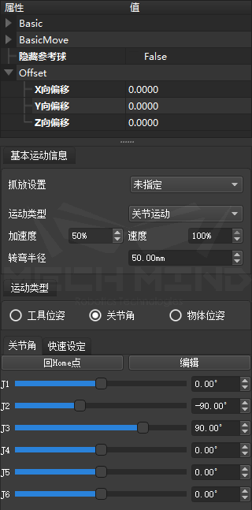

************************
Skill书写规范
************************

以Move举例

分为描述、属性等章节，属性部分使用换行缩进的方式突出属性名称并做出介绍，具体见下：

**描述**
============

此处为该step的作用描述

**属性**
============ 

移动类基础属性
    此处链接移动类通用属性介绍

隐藏参考球
    隐藏参考球模型

Offset
    X向偏移

    Y向偏移

    Z向偏移
