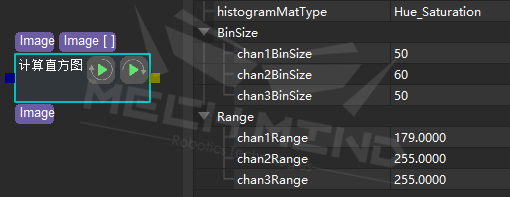

***********************
Step书写规范
***********************

以“计算直方图”举例

分为描述、参数类型、属性、示例、可能的前置/后置step等章节，属性中以区块的方式介绍每个（组）属性，具体见下：

**描述**
============

此处为该step的作用描述

**参数类型**
==============

:Image:
    [输入]源图像
:Image[]:
    [输入]mask图像列表
:Image[]:
    [输出]目标直方图列表，其图像个数与输入的mask图像列表个数相同

**属性**
============ 

histogramMatType ::

    直方图类型：用于将源图像转换为指定类型后计算图像直方图
    默认值：Hue_Saturation
    建议值：Hue_Saturation
    值列表：Gray, Hue_Saturation

**示例**
=============
此step在工程中的用法及效果

**可能的后置Step**
====================
介绍多数情况接在此step后面的step